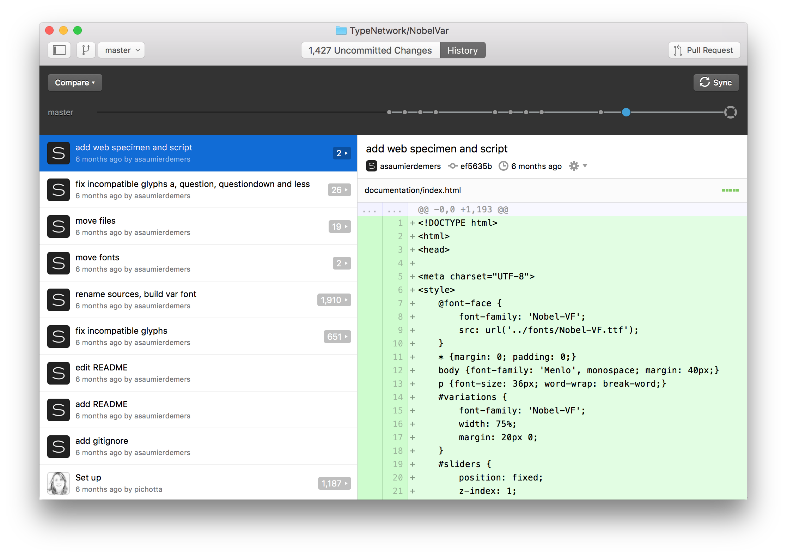

# Variable Font Baking

## Preparation

### Install libraries in the terminal

    sudo sh install.sh

## Clone the repository

### By desktop application

* Download the desktop application from github.com
* Copy the repository path from github.com and clone the repository in a local folder.



### By terminal (faster for usage with UFOs)

* Make a “git” folder on your desktop (or another place of storage)
* Copy the repository path from github.com and use it to clone the repository to a local folder

    mkdir ~/Desktop/git
    cd ~/Desktop/git
    git clone <paste-repository-path-here>
    cd ~/Desktop/git/<repository-name>

### Committing changes 

Change can be committed using the Github desktop application, or Terminal (which can be faster for usage with UFOs.)

To synchronize all online and local changes, run in Terminal:
    
    git pull; git add *; git commit -m "Description of the committed changes"; git pull; git push


**Note** that a UFO font can contain hundreds or even thousands of files, so moving a UFO to another folder (or renaming it) causes a magnitude of changes in a git commit.

* Make sure not to move UFOs around, or rename them, if not necessary.
* When you really need to, use the above Terminal command

## Open the repository 

To open the whole respository for editing, drag the entire folder into [Sublime Text](https://www.sublimetext.com). 
While many editors allow the editing of file/folder trees, Sublime offers a nice interface for running the scripts from within the application - without the need for Terminal or RoboFont.

## Collections of UFO masters

UFO masters are often grouped together in a single folder.
They do not always need form a single var-font, e.g. roman and italic UFO’s can be found in the same folder.
Instead, designspace files sort them out, and define which masters are used for which axes in which fonts.

Masters that are intended to form a single var-font must have matching glyph sets, matching points, and matching component references. 

The compatibility of the masters can be checked and altered with the RoboFont Compatibilizer tool.

## Edit design space files

To being generating var-fonts, we need to make one or more designspace files that define the axes and how the master UFOs are located. 

Several designspace files can co-exist in a folder, to test the relation between individual axes groups.


The designspace files should be named after the axes that they support.
Separate axis names with underscores.
For example:

    Nobel-wght.designspace
    Nobel-wdth.designspace
    Nobel-wdth_wght.designspace

designspace files are XML documents with a relatively simple 2-art structure:

* Definition of the axes
* Definition of the UFO masters and their axis locations

```xml
<designspace format="3">
	<axes>
		<!-- definition of axes here -->
	</axes>
	<sources>
		<!-- definition of ufo-axis-locations here here -->
	</source>
</designspace>
```

A typical axis definition looks like this:

```xml
<axis 
	minimum="30" 
	default="90" 
	maximum="250" 
	name="Parametric Weight" 
	tag="pwht">
</axis>
```

Although the values are all relative, in the latest implementation of fonttools they are more bound to the type of axis than before.

For the `pwht` axis, use the stem of the capital-H as the default value. 

A typical source definition looks like this:

```xml
<source
	familyname="Nobel" 
	filename="master_ufo3/Nobel-Regular.ufo" 
	name="Nobel-Regular.ufo" 
	stylename="Regular">
	<location>
		<dimension name="Parametric Weight" xvalue="90" />
		<dimension name="Parametric Width" xvalue="224" />
	</location>
</source>
```

Each location point on an axis (minimum value, default value and maximum value) should have exactly one master UFO defined.

The origin of the design space (often the Regular of the family) needs all axes dimensions defined inside the `<location>...</location>` tags, where the value is equal to the default value of the axis.

Masters other than the origin don’t need to specify all the axes in their locations, especially not where axes are intended to behave independently (which saves a lot of different masters to be drawn).

## Baking

Updated Nobel (also copied the CondensedBlack to BlackTmp for now). If real Black is replacing, then also the design space files should be changed to this name.
Running from Sublime (see also the VariableRecipe markdown file that I am working on. Needs download of free MacDown application to open and preview).   Open the Nobel repo in Sublime (not a free license) Uncomment (just) one of the UFO 2 design space line in the gsubrules.py.
Open the makeVar-Roman.py in hit cmd-B in Sublime. (select the Tools/Build System--> Python for the first time).
If all is installed (fontmaker, fonttools, etc). then this should create a VF in Sublime at the background.
If Finder/cmd-I is selected on a TTF font to open FontView as default, then generated VF automatically open in FontView is they are finished.

Currently there is no axis-based glyph substitution for Nobel, but it can easily be added to the file. The above will be added to the VariableRecipe with screen images. I'll do this to the others repo's too, adding more feed back scripts in case the masters don't interpolate yet, using the checks that are also inside Compatibilizer.

